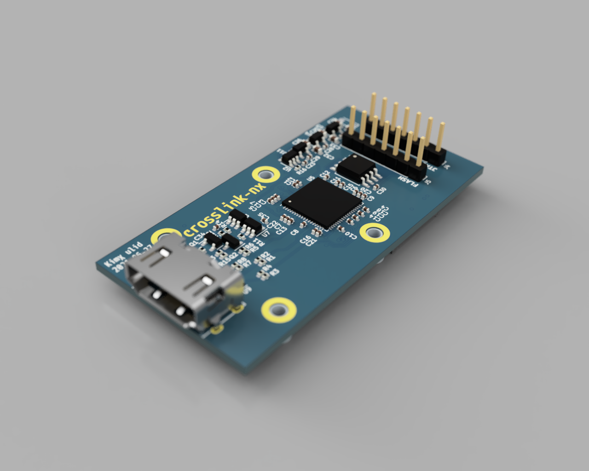
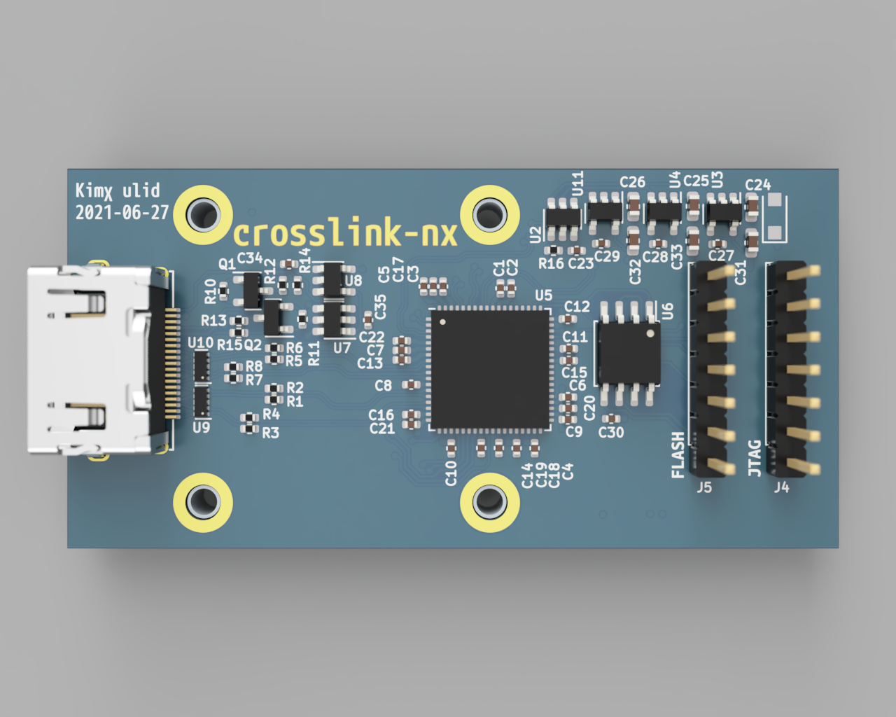

# kimχ micro lid Crosslink-nx

This project is an add-on (lid) expansion board for the [kimχ micro i.MX8M Mini SBC](https://labs.groupgets.com/kimchi-micro).

This board is designed as a general purpose plotform for the Lattice Crosslink-nx FPGA, but it's main purpose is to investigate the options for converting the 4-lane MIPI-DSI signals from the Kimchi to a standard HDMI monitor.

